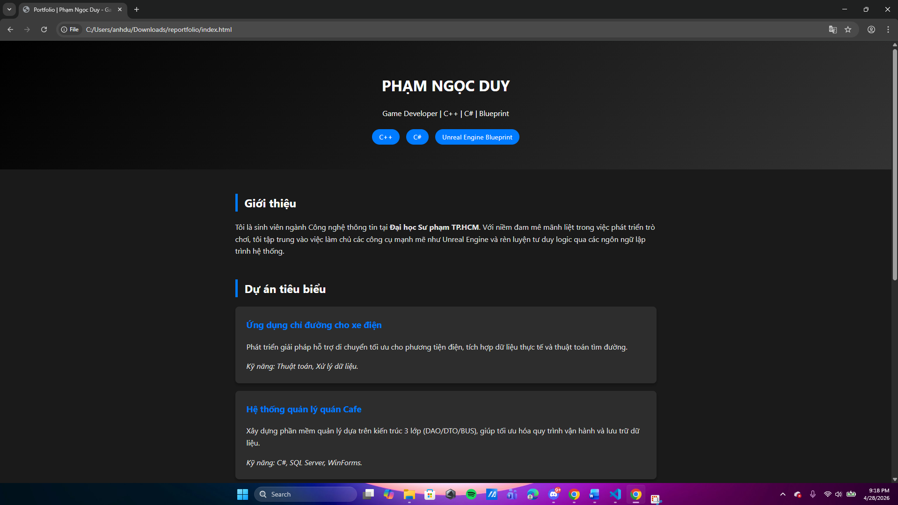

# My Portfolio - Phạm Ngọc Duy
> Chào mừng bạn đến với Portfolio cá nhân của tôi, nơi trưng bày các dự án và hành trình phát triển kỹ năng Game Developer.

## 🌐 Link Website
[Xem tại đây](https://NgokDinek.github.io/my-portfolio/) 

## 🛠 Quá trình thực hiện
1. **Lên ý tưởng:** Thiết kế giao diện tập trung vào trải nghiệm người dùng (UX) và tối ưu hóa hình ảnh.
2. **Xây dựng:** Sử dụng HTML/CSS để tạo khung, kết hợp Markdown để trình bày dự án một cách khoa học.
3. **Triển khai:** Đẩy mã nguồn lên GitHub và cấu hình GitHub Pages để xuất bản website.

## 📁 Nội dung Portfolio
- **Giới thiệu:** Thông tin cá nhân và định hướng nghề nghiệp.
- **Dự án:** Tổng hợp các sản phẩm tiêu biểu (Software & Apps).
- **Chứng chỉ:** Các khóa đào tạo chuyên sâu từ Unreal Engine và kỹ năng mềm.
- **Liên hệ:** Thông tin để kết nối trực tiếp.

## 📸 Hình ảnh mô tả

